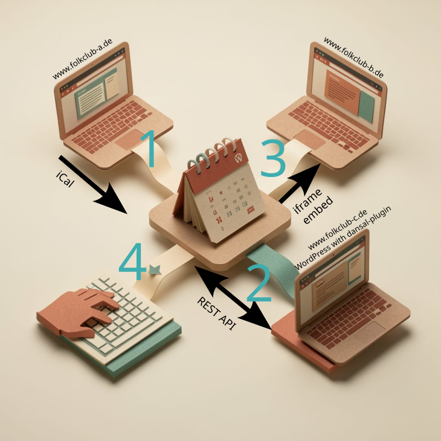

# Wie kommen Termine in den Kalender?

dansal ist als übergreifender Kalender konzipiert, um Veranstaltungen verschiedener Folkclubs übersichtlich darzustellen. Wer Bälle veranstaltet, soll möglichst einfach auch auf dansal die Termine veröffentlichen. Ohne die Veranstaltung auf mehreren Seiten einzupflegen. Oder gar auf mehreren Seiten aktualisieren zu müssen. Hierzu bietet dansal verschiedene Wege, um Veranstaltungen unterschiedlicher Vereine auf einer Seite darstellen zu können.

## 1. Eigene Website behalten, nur einen Kalender pflegen

Folkclubs, die bereits eine eigene Website betreiben, müssen ihre
Termine nicht doppelt pflegen. Wenn Termine auf der Internetseite als iCal- oder JSON-Feed abgerufen werden können, reicht es aus, diesen Link bei dansal als dauerhafte Quelle einzupflegen. Die Veranstaltungen werden automatisch in dansal kopiert. Mit dansal können deutlich mehr Informationen zur Verfügung gestellt werden als üblich. Die Stärke liegt darin, die Veranstaltungen auf einer Karte darstellen zu können. Hierzu werden den Veranstaltungsorten Koordinaten zugeordnet. Alle künftigen Veranstaltungen werden diesen Orten zugewiesen und können dann auch direkt auf der Karte dargestellt werden, ohne dass auf der eigenen Webseite die Koordinaten eingepflegt werden müssen.

Einfache Änderungen, wie zeitlich Verschiebung um 1h, können bei einem erneuten Abruf des Feed automatisch übernommen werden. Anderer Ort braucht dagegen manuelles Eingreifen.

Manchmal ist es nich möglich oder gewünscht, den kompletten Kalender in dansal zu übernehmen. Wenn für die Tanzveranstaltung dann aber ein iCal-Link angeboten wird (häufig als "in Kalender übernehmen"), kann mit diesem Link eine einzelne Veranstaltung übernommen werden. Eine automatische Aktualisierung erfolgt dann nicht.

**Vorteil:** Ein einziger, verbindlicher Kalender (Folkclub-Kalender) statt zweier Datenquellen,
die auseinanderlaufen können.

## 2. Eigene Website behalten, Termine mit dansal-Plugin verwalten
Viele Webseiten, mit denen Folkclubs ihre Internetseiten betreiben, verwenden WordPress oder vergleichbare Software. Für dansal existiert ein WordPress-Plugin, welches Veranstaltungen direkt mit dansal synchronisiert. Die Eigenschaften von dansal können direkt hier genutzt werden, um bei den Veranstaltungsorten den Tanzboden zu verwalten und weitere Punkte.

**Vorteil:** Verwaltung der Termine an einer Stelle und direkt an zwei Orten veröffentlicht.

## 3. dansal als Datenbank nutzen und Termine einbetten

Es gibt einzelne Folkclubs, welche z.B. Google Calendar verwenden und die dort eingepflegten Termine auf der eigenen Seite darstellen. Dies hat den Vorteil, dass die eigene Seite sehr einfach gehalten werden kann und keine komplexen Plugins verwaltet werden müssen. dansal kann alternativ zu einem Google Calendar verwendet werden: Die Termine werden auf dansal verwaltet. Auf der eigenen Seite können die Termine als Tabelle oder Liste eingebunden werden. Auch eine Darstellung auf einer Karte ist möglich.

**Vorteil:** Die eigene Website zeigt aktuelle Termine, ohne dass dafür
eigene Kalenderlogik gebaut oder gepflegt werden muss.

## 4. dansal als eigenständige Verwaltung nutzen

Organisationen ohne eigene Website — oder die ihre Termine dort bewusst
nicht anzeigen wollen — nutzen dansal vollständig eigenständig: Termine
anlegen und veröffentlichen, Anmeldungen und Kapazitäten verwalten,
die Pinnwand für Mitfahrgelegenheiten und Unterkunft nutzen, per
Fediverse ankündigen. Die dansal-Seite selbst übernimmt in diesem Fall
die öffentliche Auffindbarkeit — über Suchmaschinen, Kalender und Karte.

## Technik
### Import über iCal
iCal ist ein Standard, um Termine maschinenlesbar zu verbreiten, so dass die Termine direkt im eigenen Kalender auf dem Smartphone oder Desktop dargestellt werden. Diese Technik wird verwendet, um Termine in dansal einzulesen. Moderner ist das Format JSON. Letztlich sind beides lesbare Textdateien, die nur anders strukturiert sind. Je nach Software sind diese Textdateien etwas unterschiedlich gefüllt. Dies führt dazu, dass manchmal nicht alle interessanten Informationen übertragen werden.

Mit dansal können diese Textdateien geladen und die einzelnen Veranstaltungen kopiert werden.

iCal ist relativ alt und bietet nur die wichtigsten Informationen an, so dass nur ein Teil der Möglichkeiten von dansal genutzt werden. Dies liegt oft auch daran, dass für das eigene Publikum zum Beispiel keine Darstellung auf einer Karte benötigt wird, da der Ort den Leuten bekannt ist. So ist manchmal nur der Name des Orts genannt, aber keine Adresse oder Koordinaten.

Beim Einlesen der Termine werden automatisch Veranstaltungsorte angelegt. Bei neuen Veranstaltungen werden die Termine direkt diesen Orten zugewiesen. Auf dansal können die Orte um Zusatzinformationen erweitert werden, wie die Kartendarstellungen. Diese werden dann für alle künftigen Veranstaltungen übernommen. Der Pflegeaufwand auf dansal ist damit gering. Nur anfangs müssen Veranstaltungsorte gepflegt werden, danach werden nur Termine auf der eigenen Webseite gepflegt.

Änderungen an Veranstaltungen können bis zu einem gewissen Grad automatisch übernommen werden:

* Verschiebung um bis zu 3h: Wird die Veranstaltung um bis zu 3h nach vorne oder nach hinten verschoben, wird dies beim nächsten Aufruf automatisch angepasst.
* Neuer Titel: Wenn Ort und Zeit erhalten bleiben, wird ein neuer Titel direkt übernommen.
* Andere Beschreibung: Änderungen der Beschreibung werden direkt übernommen.

Wird die Veranstaltung an einen anderen Ort verschoben, kann es sein, dass dies nicht automatisch übernommen werden kann, so dass auf dansal manuell angepasst werden muss.

Der Abruf über iCal muss in dansal eingerichtet werden. dansal holt sich regelmäßig Aktualisierungen ab. Die Webseite selbst muss nicht aktiv Informationen senden.

### Export über iCal
Alle Veranstaltungen können über verschiedene Kalenderformate exportiert werden. Dabei existieren vordefinierte Filter, um nur Veranstaltungen einzelner Folkclubs oder beispielsweise nur Workshops einzubinden.

### REST API
Die Datenbank verwendet eine REST API Architektur. Hierüber können andere Dienste Informationen abrufen bzw. ändern. Das Abrufen von Daten kann ohne eigenes Konto anonym erfolgen.

Über die REST API kann ein Plugin Informationen mit dansal austauschen. Mit einem Service-Konto können Veranstaltungen für eine einzelne Organisation aktiv an dansal gesendet werden. Mit dem Service-Account können alle Möglichkeiten von dansal genutzt werden.

